# A copier at a university

## Requirements
### Functional requirements
1. It must receive a document to be copied, it can be a document maintained in physical paper form or a document maintained in electronic form. 
2. It must receive and use paper sheets to print on it, with the following sizes:  

* Letter measures 8.5 by 11 inches.
* Legal measures 8.5 by 14 inches.
* Tabloid measures 11 by 17 inches.

2. It must allow user to choose how many copies want to obtain from the source document.
   
3. It must allow user to choose if the copy will be black and white or in color.
4. It must use cyan, magenta, yellow and black ink to print color or black and white and show the ink status.
6. It must allow user to choose the size of the copy document if it will be letter, legal or tabloid.
7. It must return a document that is a copy of the source document, and this could have variations on the size and color according to the previous configurations.
8. It must count and show how many copies have copied from the time it starts working.
9. It must be able to change the document size from 25% to 200%, the values to enlarge the document starts in 101% up to 200% (101% - 102% - 103%...200%). The values to reduce the document starts in 99% and decrement until 25% (99% - 98% - 97%...25%), so the document could be smaller or bigger than the original one.
10. It must register the cost per copy according to the following prices:
    * Letter-size black and white copy (single-sided): $250.
    * Letter-size black and white copy (side by side): $500.
    * Letter-size color copy (single-sided): $1550. 
    * Letter-size color copy (side by side):$3100.
    * Legal-size black and white copy (single-sided): $300.
    * Legal-size black and white copy (side by side):$600.
    * Legal-size color copy (single-sided): $1600.
    * Legal-size color copy (side by side):$3200.
    * Tabloid-size black and white copy (single-sided): $500.
    * Tabloid-size black and white copy (side by side):$1000.
    * Tabloid-size color copy (single-sided): $1850.
    * Tabloid-size color copy (side by side):$3700. 
    * Change the document size (Additional cost to the copy):$500.

10.It must staple the document copy by sets of copies made.

### Nonfunctional requirements
1. It should be available during university hours.
2. It should be placed in the university or close to the university.
3. It should print from any compatible Wi-Fi enabled device making it usable by other devices connected to the network.

## Use cases

1. 
**Title:** Receive documents maintained in digital format from a USB memory stick.

**Primary actor:** Worker who handle the copier.

**Success scenario:** The student, teacher or university employ gives the USB memory stick to the worker. The worker insert the USB memory stick into the port and browse the USB stick, select the document to be copied.

**Secondary actor:** University students, teachers or other university employees who need to copy a document.
2.
**Title:** Receive documents maintained in digital format from a compatible network enabled device.

**Primary actor:** Compatible network enabled device.

**Success scenario:**  The device and the copier are connected to the same network. The device that is handled by one of the secondary actors select the document to be copied.

**Secondary actor:** University students, teachers or other employees who need to copy a document.
3.
**Title:** Receive documents maintained in physical paper form.

**Primary actor:** Worker who handle the copier.

**Success scenario:** The student, teacher or university employee gives the document maintained in  physical paper form to the worker. The worker receives the document and put the document on the Copier.  

**Secondary actor:** University students, teachers or other employees who need to copy a document.
4.
**Title:** Insert paper sheets.

**Primary actor:** Worker who handle the copier.

**Success scenario:** The worker places the amount of paper sheets with the size needed to print the source document according to the number of copies and size required.
5.
**Title:** Configure the characteristics of the copy.

**Primary actor:** Worker who handle the copier.

**Success scenario:** The worker sets the number of copies needed, the worker sets the color needed and the worker sets the size of the copies according to the secondary actor preferences.

**Secondary actors:** University students, teachers or other employs who need to copy source documents.
6.
**Title:** Refill copier ink.

**Primary actor:** Worker who handle the copier.

**Success scenario:** The worker opens the ink tank unit cover. the worker refills the ink tank with the correct color ink and the copier notifies the ink tank for that color is full. The worker refills each tank with cyan, magenta, yellow and black ink. 
8.
**Title:** Copy the source document.

**Primary actor:** Worker who handle the copier.

**Success scenario:** The worker inserts the source document, and the copier copies the source document on the paper sheets according to the configurations.

9.
**Title:** Count copies made.

**Primary actor:** Accountant.

**Success scenario:** The copier count each copy made. The copier can display the total number of copies: black and white copies, and color copies from the time the copier was purchased. The accountant review this information.
10.
**Title:** Enlarge document.

**Primary actor:** worker who handle the copier.

**Success scenario:** The copier shows 100% by default, and it means the copy will be exactly equal to the size of the original document. The worker can enlarge a document up to twice its original size (200%). The worker selects the increment desired, the values to enlarge the document starts in 101% up to 200% (101% - 102% - 103%...200%).
11.
**Title:** Reduce document.

**Primary actor:** worker who handle the copier.

**Success scenario:** The copier shows 100% by default, and it means the copy will be exactly equal to the size of the original document. The worker can reduce a document up to a quarter of its original size (25%). The worker selects the decrement value desired, the values to reduce the document starts in 99% until 25% (99% - 98% - 97%...25%).
12.
**Title:** Calculate cost per copy.

**Primary actor:** The worker who handle the copier.

**Success scenario:** The worker sets the cost of a single sheet in the copier according to copy configurations. the copier calculate the total cost of the copies made. A Letter-size black and white copy (single-sided) costs $250, and 4 copies are made, so the copier calculate the total cost of copies: $1000. The accountant review the total costs.

    * Letter-size black and white copy (single-sided): $250.
    * Letter-size black and white copy (side by side): $500.
    * Letter-size color copy (single-sided): $1550.
    * Letter-size color copy (side by side):$3100.
    * Legal-size black and white copy (single-sided): $300.
    * Legal-size black and white copy (side by side):$600.
    * Legal-size color copy (single-sided): $1600.
    * Legal-size color copy (side by side):$3200.
    * Tabloid-size black and white copy (single-sided): $500.
    * Tabloid-size black and white copy (side by side):$1000.
    * Tabloid-size color copy (single-sided): $1850.
    * Tabloid-size color copy (side by side):$3700.
    * Change the document size (Additional cost to the copy):$500.

**Secondary actor:** Accountant.
13.
**Title:** Staple the document copy by sets of copies.

**Primary actor:** The worker who handle the copier.

**Success scenario:** The worker select the desired staple option in the staple menu with the position options to be stapled (upper left or upper right) and put together the paper-sheets.  
14.
**Title:** Select pages to be copied.

**Primary actor:** Compatible network enabled device.

**Success scenario:** The device and the copier are connected to the same network. The device that is handled by one of the secondary actors selects the pages from the document to be copied.

### Use Case Diagram

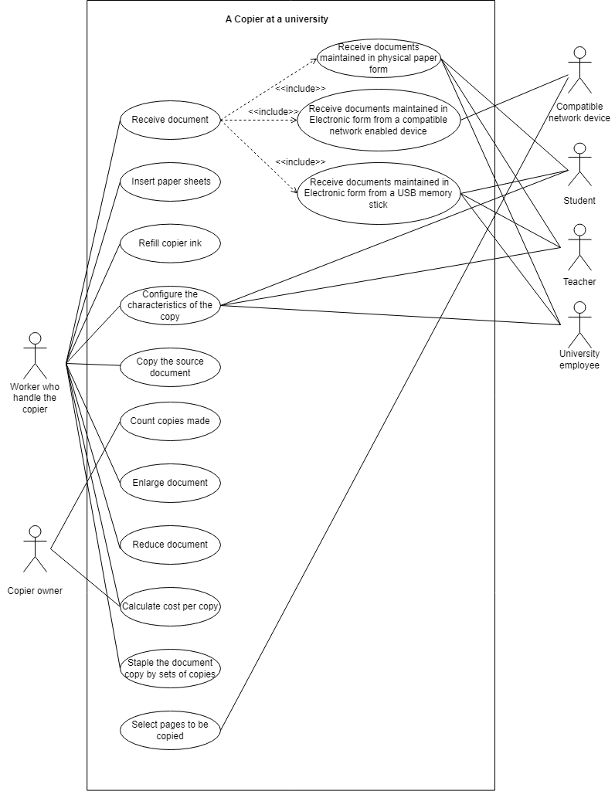

## Conceptual Object Model
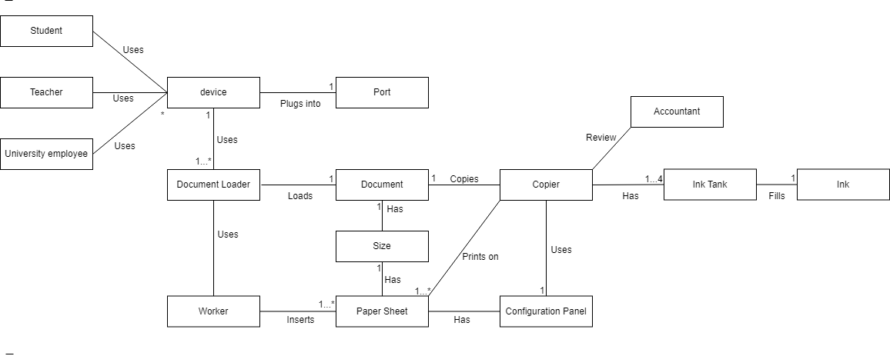

## CRC Cards

Every card will have either one single class, interface or abstract class.

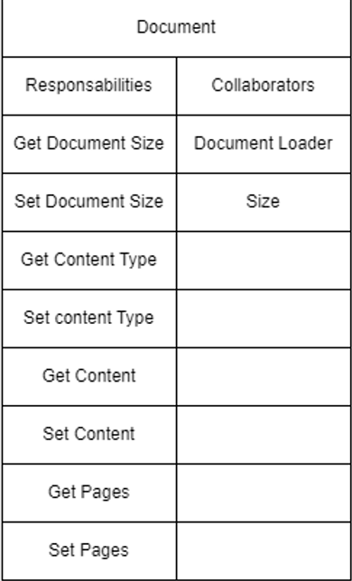

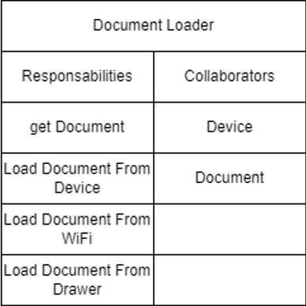

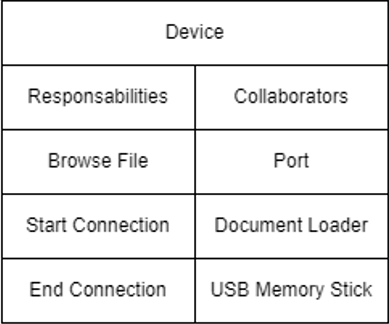

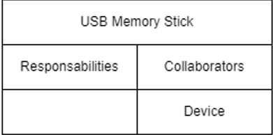

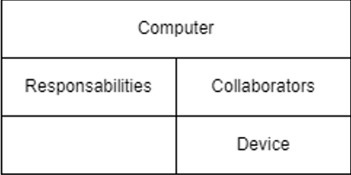

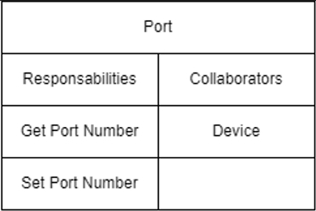

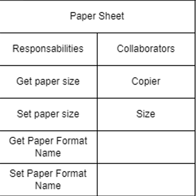

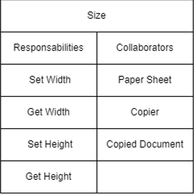

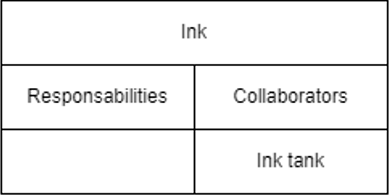

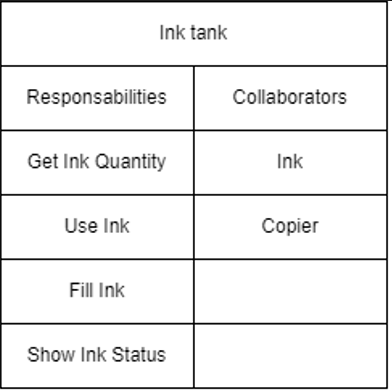

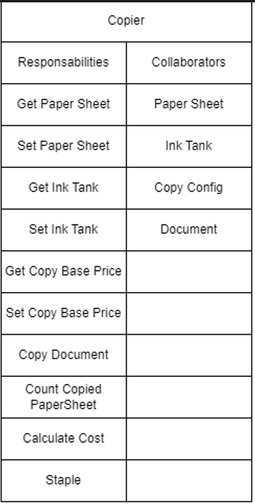

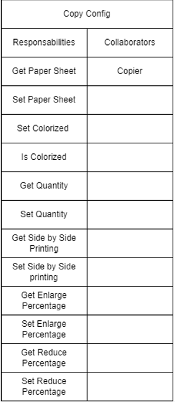

## Class Diagram and UML
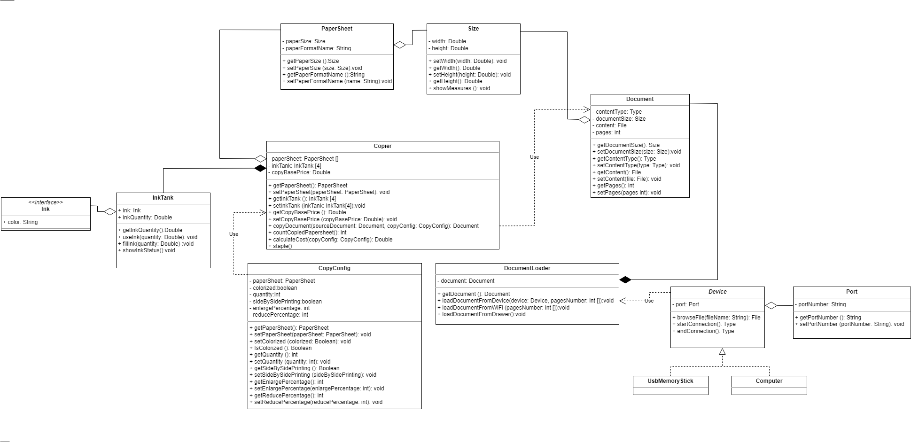

